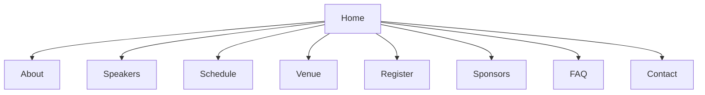

# Event Website Builder with Loft

*Create stunning, responsive event websites with Loft's intuitive drag-and-drop builder. No coding required – just beautiful designs that convert visitors into attendees.*

## Quick Start

### Accessing the Website Builder
1. Log in to your Loft account
2. Navigate to **Events** > **Your Event** > **Website**
3. Click **Edit Website** to launch the builder

### Key Features
- 100+ responsive templates
- Drag-and-drop editor
- Custom domain support
- SEO optimization tools
- Built-in analytics
- Mobile preview

## Step 1: Choose & Customize Your Template

### 1.1 Browse Templates
1. Click **Templates** in the left sidebar
2. Filter by:
   - Event type (Conference, Workshop, etc.)
   - Industry
   - Style (Minimal, Bold, Modern, etc.)
   - Color scheme

2. **Preview & Select**
   - Hover and click **Preview**
   - Toggle between desktop/mobile views
   - Click **Use Template** to apply

### 1.2 Template Customization
1. **Global Styles**
   - **Colors**: Set primary, secondary, and accent colors
   - **Typography**: Choose from 50+ Google Fonts
   - **Spacing**: Adjust padding and margins
   - **Effects**: Add shadows, borders, and hover effects

2. **Page Layouts**
   - Homepage hero sections
   - Schedule/Agenda
   - Speaker profiles
   - Registration forms
   - Venue information
   - Sponsors/Partners

## Step 2: Build Your Pages

### 2.1 Core Pages
1. **Homepage**
   - Hero section with call-to-action
   - Event countdown timer
   - Key highlights
   - Featured speakers
   - Testimonials

2. **Agenda**
   - Day-by-day schedule
   - Session tracks
   - Speaker information
   - Add to calendar

3. **Speakers**
   - Speaker grid/list view
   - Individual speaker pages
   - Session links
   - Social media integration

4. **Venue**
   - Interactive map
   - Travel information
   - Parking/transportation
   - Local attractions

### 2.2 Content Elements
1. **Media**
   - Image galleries
   - Video backgrounds
   - Image carousels
   - Logo walls

2. **Interactive**
   - Countdown timers
   - Registration forms
   - Social media feeds
   - Live chat

## Step 3: Configure Site Settings

### 3.1 Domain & SEO
1. **Custom Domain**
   - Connect existing domain
   - Purchase new domain
   - Set up subdomains

2. **SEO Optimization**
   - Page titles & meta descriptions
   - Custom URLs
   - Sitemap generation
   - Robot.txt configuration

### 3.2 Integrations
1. **Analytics**
   - Google Analytics
   - Facebook Pixel
   - Hotjar

2. **Marketing Tools**
   - Email marketing (Mailchimp, etc.)
   - CRM integration
   - Live chat support

## Step 4: Publish & Manage

### 4.1 Pre-Launch Checklist
1. **Content Review**
   - Proofread all text
   - Check image quality
   - Test all links
   - Verify forms work

2. **Mobile Optimization**
   - Test on multiple devices
   - Check touch targets
   - Optimize images
   - Test loading speed

### 4.2 Launch & Monitor
1. **Publish Options**
   - Publish immediately
   - Schedule for later
   - Set up password protection

2. **Post-Launch**
   - Monitor site analytics
   - Set up alerts
   - Regular backups
   - Update content as needed

## Troubleshooting

### Common Issues

#### Page Not Loading
1. Clear browser cache
2. Check internet connection
3. Try incognito mode

#### Form Submissions Not Working
1. Check required fields
2. Verify reCAPTCHA settings
3. Test with different browsers

## Support

### Help Resources
- **In-App**: Click **Help** > **Website Builder**
- **Email**: [website@loft.events](mailto:website@loft.events)
- **Phone**: +1 (555) 123-4587

### Training
- [Video Tutorials](#)
- [Website Templates](#)
- [Live Workshops](#)

---
*Last updated: June 1, 2024*  
*Need help with your event website? Our team is here to assist!*

## Step 3: Add Event Details

### Homepage
1. Click on the hero section
2. Update the event title, date, and location
3. Upload a background image or video
4. Customize the call-to-action button

### Event Information
1. Click **Add Section** > **Event Details**
2. Add your event description
3. Include key highlights or features
4. Add an image gallery or video

### Schedule
1. Click **Add Section** > **Schedule**
2. Click **Add Session**
3. Enter session details (title, time, speaker)
4. Repeat for all sessions

## Step 4: Set Up Registration

### Registration Form
1. Go to **Registration** > **Form Builder**
2. Add standard fields (Name, Email, etc.)
3. Create custom fields if needed
4. Set required fields

### Ticket Types
1. Go to **Tickets**
2. Click **Add Ticket Type**
3. Set name, price, and quantity
4. Configure early bird or group discounts

## Step 5: Configure Settings

### Domain
1. Go to **Settings** > **Domain**
2. Choose a subdomain (your-event.lo.ft)
3. Or connect a custom domain

### SEO
1. Go to **Settings** > **SEO**
2. Enter meta title and description
3. Add social sharing images
4. Submit sitemap to search engines

## Step 6: Publish Your Site

1. Click **Preview** to check your site
2. Test all links and forms
3. Click **Publish**
4. Share your site URL with attendees

## Advanced Features

### Integrations
1. **Google Analytics**
   - Go to **Settings** > **Integrations**
   - Click **Connect** next to Google Analytics
   - Enter your Tracking ID (starts with UA- or G-)
   - Click **Save**

2. **Facebook Pixel**
   - In **Settings** > **Integrations**
   - Click **Connect** next to Facebook Pixel
   - Enter your Pixel ID
   - Toggle on **Track Page Views**
   - Click **Save**

3. **Email Marketing**
   - Navigate to **Integrations**
   - Select your email service (Mailchimp, HubSpot, etc.)
   - Follow the OAuth prompts to connect
   - Map registration form fields

### Mobile Optimization
1. **Preview & Edit**
   - Click the mobile icon in the top toolbar
   - Toggle between device views (mobile, tablet, desktop)
   - Make mobile-specific adjustments

2. **Mobile Settings**
   - Adjust font sizes for mobile
   - Stack sections vertically
   - Optimize button sizes
   - Test touch targets (minimum 44x44px)

3. **Testing**
   - Use the built-in device emulator
   - Test on actual devices
   - Check loading speed with Google's Mobile-Friendly Test

## Troubleshooting

### Common Issues

#### Images Not Loading
1. **Check File Size**
   - Maximum file size: 5MB
   - Recommended: 1920x1080px, under 500KB
   - Use the built-in image optimizer

2. **Format Issues**
   - Supported formats: JPG, PNG, WebP
   - Convert HEIC/HEIF to JPG
   - Remove special characters from filenames

3. **Quick Fixes**
   - Clear browser cache (Ctrl/Cmd + Shift + R)
   - Try a different browser
   - Check image URL in the media library

#### Form Submissions Not Working
1. **Form Configuration**
   - Verify all required fields are marked
   - Check field validation rules
   - Test with different input formats

2. **reCAPTCHA**
   - Go to **Registration** > **Security**
   - Verify reCAPTCHA keys
   - Test with v2 or v3

3. **Email Notifications**
   - Check spam/junk folder
   - Verify email settings in **Notifications**
   - Test with different email providers

## Need Help?

### Support Resources
1. **Knowledge Base**
   - [Website Builder Guide](#)
   - [Video Tutorials](#)
   - [Step-by-Step Articles](#)

2. **Direct Support**
   - **Live Chat**: Click the chat icon (bottom right)
   - **Email**: [support@loft.events](mailto:support@loft.events)
   - **Phone**: +1 (555) 123-4574 (24/7)
   - **Response Time**: 
     - Live Chat: <5 minutes
     - Email: <2 hours
     - Phone: Immediate

### Community & Learning
1. **Community Forum**
   - [Ask questions](#)
   - [Share templates](#)
   - [Get feedback](#)

2. **Live Webinars**
   - [Website Design Masterclass](#) (Weekly)
   - [SEO for Events](#) (Monthly)
   - [Q&A Sessions](#) (Bi-weekly)

3. **Template Showcase**
   - [View examples](#)
   - [Get inspired](#)
   - [Submit your design](#)

### Emergency Support
For urgent website issues:
1. **Critical Issues** (site down, security breach)
   - Call: +1 (555) 123-9999
   - Email: [critical@loft.events](mailto:critical@loft.events)
   - 24/7 priority support

2. **After Hours Support**
   - Use the emergency contact form
   - Include "URGENT" in subject line
   - Expect response within 30 minutes

## Step 1: Plan Your Website

### 1.1 Define Website Goals
- **Primary Objective**: Registrations, awareness, community building
- **Target Audience**: Demographics, interests, tech-savviness
- **Key Actions**: Register, learn more, share, contact
- **Success Metrics**: Conversion rate, traffic sources, engagement

### 1.2 Sitemap Structure

## Step 2: Choose a Template

### 2.1 Template Categories
| Style | Best For | Example Themes |
|-------|----------|----------------|
| **Conference** | Professional events | Corporate, Tech |
| **Festival** | Multi-day events | Music, Food |
| **Workshop** | Educational events | Training, Webinars |
| **Gala** | Formal events | Awards, Charity |

### 2.2 Template Features
- **Responsive Design**: Mobile, tablet, desktop
- **Page Builder**: Drag-and-drop interface
- **Pre-built Sections**: Hero, schedule, speakers
- **Customization**: Colors, fonts, layouts
- **Integrations**: Registration, social media

## Step 3: Customize Design

### 3.1 Branding
1. **Logo & Favicon**
   - Upload high-res logo (min 400px wide)
   - Set favicon (32x32px)
   - Add browser theme color

2. **Color Scheme**
   - Primary brand color
   - Secondary colors
   - Background colors
   - Text colors (ensure contrast)

### 3.2 Layout & Navigation
- **Header**: Logo, main menu, CTA button
- **Hero Section**: Event title, date, location, CTA
- **Content Blocks**: Customizable sections
- **Footer**: Contact, social links, copyright
- **Mobile Menu**: Hamburger or tabbed

## Step 4: Add Event Details

### 4.1 Essential Pages
1. **Homepage**
   - Hero with countdown
   - Event highlights
   - Featured speakers
   - Call-to-action buttons

2. **About Page**
   - Event description
   - Organizer info
   - Past events
   - Testimonials

3. **Schedule Page**
   - Day-by-day breakdown
   - Session tracks
   - Speaker info
   - Add to calendar

### 4.2 Media & Content
- **Images**: High-quality, optimized (max 1MB)
- **Videos**: Embedded from YouTube/Vimeo
- **Maps**: Interactive venue maps
- **Documents**: PDF schedules, brochures

## Step 5: Configure Registration

### 5.1 Registration Setup
1. **Ticket Types**
   - General admission
   - VIP/All-access
   - Group discounts
   - Early bird pricing

2. **Form Fields**
   - Contact information
   - Custom questions
   - Dietary restrictions
   - Session preferences

### 5.2 Payment Integration
- **Payment Gateways**: Stripe, PayPal, etc.
- **Currency Options**: Multi-currency support
- **Discount Codes**: Create and manage
- **Confirmation Emails**: Customize templates

## Step 6: Optimize for SEO

### 6.1 On-Page SEO
- **Page Titles**: 50-60 characters
- **Meta Descriptions**: 150-160 characters
- **Header Tags**: Proper H1, H2, H3 structure
- **URL Structure**: Clean, keyword-rich URLs
- **Image Alt Text**: Descriptive, with keywords

### 6.2 Technical SEO
- **Mobile Optimization**: Google Mobile-Friendly Test
- **Page Speed**: Aim for <3s load time
- **SSL Certificate**: HTTPS required
- **Sitemap**: Auto-generated XML sitemap
- **Structured Data**: Event schema markup

## Step 7: Publish & Promote

### 7.1 Pre-Launch Checklist
- [ ] Test all links and forms
- [ ] Check mobile responsiveness
- [ ] Verify SEO elements
- [ ] Test registration process
- [ ] Set up analytics

### 7.2 Promotion Channels
- **Email Marketing**: Send to your list
- **Social Media**: Share across platforms
- **Paid Ads**: Facebook, Google, LinkedIn
- **Partnerships**: Cross-promote with sponsors
- **PR Outreach**: Local media, industry blogs

## Pro Tips & Best Practices

### Design & UX
1. **Visual Hierarchy**
   - Clear CTAs
   - White space
   - Readable typography
   - Consistent styling

2. **Performance**
   - Optimize images
   - Minify CSS/JS
   - Enable caching
   - Use CDN

### Content Strategy
1. **Engagement**
   - Blog posts
   - Speaker interviews
   - Behind-the-scenes
   - User-generated content

2. **Accessibility**
   - Alt text for images
   - Keyboard navigation
   - Color contrast
   - ARIA labels

## Troubleshooting

### Common Issues & Solutions

#### Website Loading
1. **Problem**: Slow loading
   - Optimize images
   - Enable caching
   - Check hosting resources

2. **Problem**: Broken links
   - Run link checker
   - Update URLs
   - Set up 301 redirects

#### Registration Issues
1. **Problem**: Form not submitting
   - Check required fields
   - Test payment gateway
   - Clear cache/cookies

2. **Problem**: Emails not received
   - Check spam folder
   - Verify email settings
   - Test with different email

## Get Help with Your Website

### Support
- **Help Center**: [Visit Help Center](#)
- **Live Chat**: Click the chat icon in the dashboard
- **Email**: [websites@loft.events](mailto:websites@loft.events)
- **Phone**: +1 (555) 123-4574

### Resources
- [Video Tutorials](#)
- [Template Gallery](#)
- [Web Design Tips](#)

### Community
- [Community Forum](#)
- [Upcoming Webinars](#)
- [Success Stories](#)

---
*Last updated: June 1, 2024*  
*Need help with your event website? Our support team is available 24/7!*
