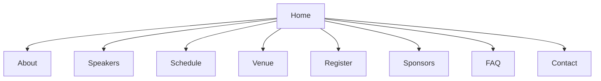

# Event Websites: Complete Guide

*Create a stunning, high-converting event website with our comprehensive guide. From initial setup to advanced customization, learn how to build a professional online presence for your event.*

## Table of Contents
- [Before You Start](#before-you-start)
- [Step 1: Plan Your Website](#step-1-plan)
- [Step 2: Choose a Template](#step-2-template)
- [Step 3: Customize Design](#step-3-design)
- [Step 4: Add Event Details](#step-4-content)
- [Step 5: Configure Registration](#step-5-registration)
- [Step 6: Optimize for SEO](#step-6-seo)
- [Step 7: Publish & Promote](#step-7-publish)
- [Pro Tips & Best Practices](#pro-tips)
- [Troubleshooting](#troubleshooting)
- [Need Help?](#help)

## Before You Start

### What You'll Need:
- Event details (date, location, schedule)
- High-quality images and videos
- Brand assets (logo, colors, fonts)
- Registration requirements
- Social media links

### Quick Links:
- [Website Templates](#)
- [Design Guidelines](#)
- [SEO Checklist](#)

## Step 1: Plan Your Website

### 1.1 Define Website Goals
- **Primary Objective**: Registrations, awareness, community building
- **Target Audience**: Demographics, interests, tech-savviness
- **Key Actions**: Register, learn more, share, contact
- **Success Metrics**: Conversion rate, traffic sources, engagement

### 1.2 Sitemap Structure

## Step 2: Choose a Template

### 2.1 Template Categories
| Style | Best For | Example Themes |
|-------|----------|----------------|
| **Conference** | Professional events | Corporate, Tech |
| **Festival** | Multi-day events | Music, Food |
| **Workshop** | Educational events | Training, Webinars |
| **Gala** | Formal events | Awards, Charity |

### 2.2 Template Features
- **Responsive Design**: Mobile, tablet, desktop
- **Page Builder**: Drag-and-drop interface
- **Pre-built Sections**: Hero, schedule, speakers
- **Customization**: Colors, fonts, layouts
- **Integrations**: Registration, social media

## Step 3: Customize Design

### 3.1 Branding
1. **Logo & Favicon**
   - Upload high-res logo (min 400px wide)
   - Set favicon (32x32px)
   - Add browser theme color

2. **Color Scheme**
   - Primary brand color
   - Secondary colors
   - Background colors
   - Text colors (ensure contrast)

### 3.2 Layout & Navigation
- **Header**: Logo, main menu, CTA button
- **Hero Section**: Event title, date, location, CTA
- **Content Blocks**: Customizable sections
- **Footer**: Contact, social links, copyright
- **Mobile Menu**: Hamburger or tabbed

## Step 4: Add Event Details

### 4.1 Essential Pages
1. **Homepage**
   - Hero with countdown
   - Event highlights
   - Featured speakers
   - Call-to-action buttons

2. **About Page**
   - Event description
   - Organizer info
   - Past events
   - Testimonials

3. **Schedule Page**
   - Day-by-day breakdown
   - Session tracks
   - Speaker info
   - Add to calendar

### 4.2 Media & Content
- **Images**: High-quality, optimized (max 1MB)
- **Videos**: Embedded from YouTube/Vimeo
- **Maps**: Interactive venue maps
- **Documents**: PDF schedules, brochures

## Step 5: Configure Registration

### 5.1 Registration Setup
1. **Ticket Types**
   - General admission
   - VIP/All-access
   - Group discounts
   - Early bird pricing

2. **Form Fields**
   - Contact information
   - Custom questions
   - Dietary restrictions
   - Session preferences

### 5.2 Payment Integration
- **Payment Gateways**: Stripe, PayPal, etc.
- **Currency Options**: Multi-currency support
- **Discount Codes**: Create and manage
- **Confirmation Emails**: Customize templates

## Step 6: Optimize for SEO

### 6.1 On-Page SEO
- **Page Titles**: 50-60 characters
- **Meta Descriptions**: 150-160 characters
- **Header Tags**: Proper H1, H2, H3 structure
- **URL Structure**: Clean, keyword-rich URLs
- **Image Alt Text**: Descriptive, with keywords

### 6.2 Technical SEO
- **Mobile Optimization**: Google Mobile-Friendly Test
- **Page Speed**: Aim for <3s load time
- **SSL Certificate**: HTTPS required
- **Sitemap**: Auto-generated XML sitemap
- **Structured Data**: Event schema markup

## Step 7: Publish & Promote

### 7.1 Pre-Launch Checklist
- [ ] Test all links and forms
- [ ] Check mobile responsiveness
- [ ] Verify SEO elements
- [ ] Test registration process
- [ ] Set up analytics

### 7.2 Promotion Channels
- **Email Marketing**: Send to your list
- **Social Media**: Share across platforms
- **Paid Ads**: Facebook, Google, LinkedIn
- **Partnerships**: Cross-promote with sponsors
- **PR Outreach**: Local media, industry blogs

## Pro Tips & Best Practices

### Design & UX
1. **Visual Hierarchy**
   - Clear CTAs
   - White space
   - Readable typography
   - Consistent styling

2. **Performance**
   - Optimize images
   - Minify CSS/JS
   - Enable caching
   - Use CDN

### Content Strategy
1. **Engagement**
   - Blog posts
   - Speaker interviews
   - Behind-the-scenes
   - User-generated content

2. **Accessibility**
   - Alt text for images
   - Keyboard navigation
   - Color contrast
   - ARIA labels

## Troubleshooting

### Common Issues & Solutions

#### Website Loading
1. **Problem**: Slow loading
   - Optimize images
   - Enable caching
   - Check hosting resources

2. **Problem**: Broken links
   - Run link checker
   - Update URLs
   - Set up 301 redirects

#### Registration Issues
1. **Problem**: Form not submitting
   - Check required fields
   - Test payment gateway
   - Clear cache/cookies

2. **Problem**: Emails not received
   - Check spam folder
   - Verify email settings
   - Test with different email

## Need Help?

### Immediate Support
- **In-App Chat**: Available in the dashboard
- **Phone**: (555) 123-4574 (24/7 support)
- **Email**: websites@loft.events

### Learning Resources
- [Website Design Guide](#)
- [Video Tutorials](#)
- [Templates Gallery](#)

### Community & Support
- [Help Center](#)
- [Webmaster Forum](#)
- [FAQs](#)

---
*Last updated: June 1, 2024*  
*Need help with your event website? Our team is here to assist!*
